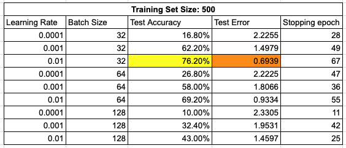
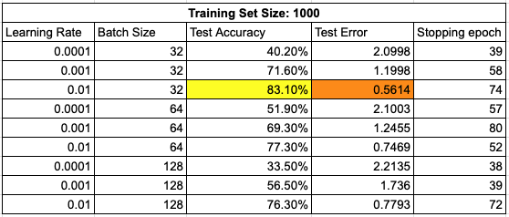

# Part 1.1

## Hypothesis
For small training sets (1×10, 5×10), the model might struggle to learn enough patterns due to limited data, leading to underfitting. It’s expected that the best performance will require fewer training epochs, likely under 10.

For medium-sized training sets (10×10, 50×10), the model should generalize better because it has more data to learn from. The test accuracy might improve steadily and then level off after around 20–50 epochs.

For the largest training set (100×10), the model is expected to achieve the highest accuracy. However, adding more data might have smaller benefits, and training for too many epochs could lead to overfitting.

A learning rate of 0.001 should help the model learn efficiently without large jumps or instability. Using a pre-trained ResNet50 model (originally trained on ImageNet) is expected to work well for the Modified MNIST dataset because the model already knows how to recognize basic patterns like edges and textures. Fine-tuning the final layer should adapt these patterns to the new task.

By setting patience to 10 (stopping if accuracy doesn’t improve for 10 epochs), we expect the model to stop training automatically to prevent overfitting or wasting time on unnecessary epochs.

## Experiment

### (a) Test Error vs Train Size Plot
Below is the plot recording the lowest test error vs. train size:

With the figure above, we observe two trends: the stopping epochs increase as the training size grows, and the test error decreases with larger training sets.

- When the training set is small, the model quickly learns the limited patterns and converges faster, requiring fewer epochs.
- As the training size increases, the model has more varied examples, which require additional epochs to learn patterns effectively.
- A larger training set enables the model to generalize better to unseen data, reducing test error.

In summary, stopping epochs increase with training size because more data takes longer to process and learn, while test error decreases as larger datasets allow the model to generalize better and reduce overfitting.

### (b) Test Accuracy, Error, and Stopping Epoch Table
Below are tables recording test accuracy, test error, and stopping epochs. The highest test accuracy is represented in yellow, and the lowest test error in orange.

#### Train Set 10

#### Train Set 50

#### Train Set 100

#### Train Set 500

#### Train Set 1000

The experiment results align with the initial hypothesis, with some deviations:
- **Small training sets (10 and 50 images)**: The model underperformed due to underfitting, with low accuracy (~20%) and high test errors. Higher learning rates (0.01) led to instability.
- **Medium-sized training sets (100 and 500 images)**: The model generalized better, achieving significantly lower test errors and higher accuracies (up to 76.20%). However, optimal performance required more training epochs than anticipated.
- **Largest training set (1,000 images)**: The model achieved the highest accuracy (83.10%) and the lowest test error (0.5614), with diminishing returns beyond 500 images.

Overall, the results confirm the hypothesis regarding underfitting with small datasets, improved generalization with larger datasets, and diminishing returns with extensive data.

## Inference about the Transfer Learning Process
Using ResNet50 to train on the modified MNIST dataset revealed key insights:

- **Feature Generalization**: Pre-trained ResNet50 extracts general visual features like edges and textures, which effectively transfer to simpler datasets like modified MNIST.
- **Computational Efficiency**: Transfer learning reduces training time by freezing pre-trained layers and fine-tuning only the final layer.
- **Dataset Similarity**: While ImageNet (ResNet50’s pre-training dataset) is vastly different from MNIST, the pre-trained features still provide a strong starting point. Fine-tuning is required to adapt these features effectively.
- **Limited Training Data**: Transfer learning helps mitigate overfitting when training data is scarce. Even with small datasets, the model achieved competitive accuracy.

## Impact of the Pre-training Set
The pre-training set significantly influences model performance. ResNet50's pre-trained features reduced the effort required for training on modified MNIST. The effectiveness depends on:
- **Similarity between the pre-training dataset (ImageNet) and target dataset (modified MNIST).**
- **Quality of pre-trained features.**
- **Fine-tuning approach.**

Despite differences between ImageNet and MNIST, ResNet50’s pre-trained features provided a strong foundation, demonstrating the power of transfer learning.

---

# Part 1.2

### Achieved Accuracy
Using transfer learning with the MNIST and FashionMNIST train set, I achieved the highest accuracy of **84.94%** with a learning rate of **0.01**, batch size **8**, and **10 epochs**.

Initial setup: **Learning rate: 0.01, Batch size: 4, Epochs: 10**
- **Batch size: 4** → 99% train accuracy, 89.11% test accuracy → Overfitting (train-test difference > 10%)
- **Batch size: 6** → 95% train accuracy, 83.03% test accuracy → Still overfitting.
- **Batch size: 8** → 90% train accuracy, 84.94% test accuracy → Acceptable balance (train-test difference ~5%).

By adjusting the batch size, we reduced overfitting while maintaining high accuracy.

